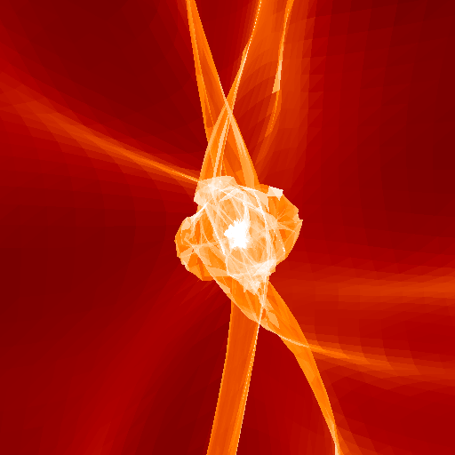

# LTFE (Lagrangian Sheet Field Estimation)

This is a CPU implementation of the Lagrangian Sheet density estimation method proposed in Shandaring et al. (2012) and Abel et al. (2012). The main idea is to assume that mass is a continuous field decomposed in volumes defined by the initial particle grid (instead of assuming that particles are a sampling of the continuous density field). Assuming mass conservation inside each volume we can easily compute densities at any time by tracing the Lagrangian grid. This is the best available method to compute densities in the low and medium (delta < 0) density regime.

 "Description goes here")

and a zoom in the halo near the center of the simulation box:

## Implementation

The code starts by decomposing the particle grid into tetrahedra. There are 8 possible options for this decomposition (23 orientations). I included two versions of the code, one computes density from one single orientation and the other version computes the average of the 8 possible orientations.

The next step is rendering into a datacube. Each tetrahedron is mapped to the output datacube and sliced along the z-axis at the position of each z slice in the datacube. At each slice the resulting triangle is rendered using a standard rendering algorithm used for 3D graphics. The rendering is the most expensive part of the code and I used a highly optimized version described here: http://devmaster.net/forums/topic/1145-advanced-rasterization/

The rasterization could have been done faster on the GPU using a simple openGL floating point rendering. However I wanted a CPU multi-threaded version that was not constrained by memory so I could run very large simulations and produce large datacubes. Still the code is very fast and has linear scaling on multicore systems. A simulation with 5123 particles rendered on a 10243 grid will take a few minutes to run on a 64 core workstation.

## Practical notes:

* This implementation works on N-body simulations with an initial regular particle grid (i.e. no glass particles). It should work for any N3 particle grid although I have only tested it with 2N cases. 

* Particles must be sorted and follow the order of variation _x_ -> _y_ -> _z_ i.e. _x_ varies the fastest, the _y_ and finally _z_.

* In principle there is no limit on the particle size and output resolution. I have produced density fields of 20483 size with no problem.

## Using this code:

If you find this code useful I would appreciate if you could point to this github and cite it if you use the code in your research.
